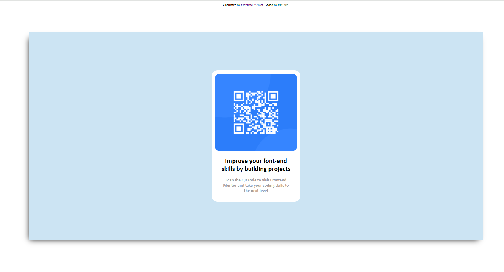

- [Overview](A mini task to build a QR code card from [Frontend_Mentor](https://www.frontendmentor.io/challenges/qr-code-component-iux_sIO_H) )
- [My process](# I started watching the screenshot where i supposed to be inspired and building it in my head step by step and started after.
  First i created a div with the class "card-container" and inside of this div another div with class "card" and inside of class "card" i created another 2 div's where i added the QR code image in a img tag and in the second div 2 paragraph's for the first paragraph i gave the class "fp" and for the second paragraph the clas "sp". and then i created a css folder where i created a css file and link it to the html wher i started to design it and as well make it responsive for smaller screens. )
  - [Built with](HTML5 CSS)
  - [What I learned](I learned that i can perfectly center an object just with padding)
  - [Author](Chirica Emilian)

### Built with

- Semantic HTML5 markup
- CSS custom properties
- Mobile-first workflow

### What I learned

Use this section to recap over some of your major learnings while working through this project. Writing these out and providing code samples of areas you want to highlight is a great way to reinforce your own knowledge.

## Author

-Linkedin- [Emilian Chirica](https://www.linkedin.com/in/emilian-chirica-39573a135/)

## Advice

To start this Challange my onest advice is that you need the basic knowledge of HTML & CSS!!!!
